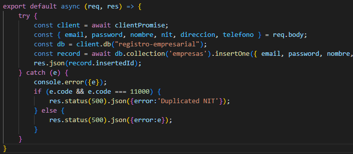
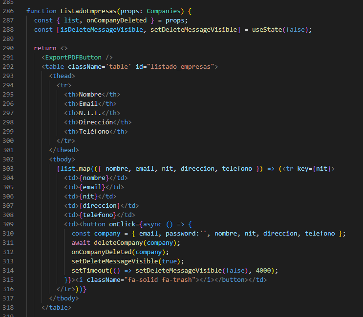
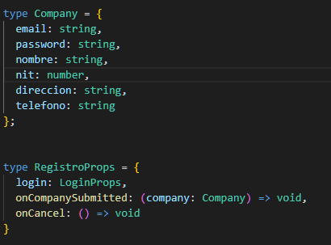
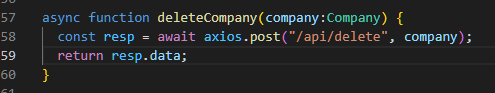

# Registro Empresarial - una demo para Lite Thinking
## Bienvenidos!

[Registro-empresarial](https://www.mongodb.com/) es una aplicación de demo de mis habilidades con React y Node, desarrollada como mi respuesta a una prueba técnica de Lite Thinking.

A continuación hago un breve resumen de las tecnologías utilizadas y entrego uno que otro detalle sobre su arquitectura y construcción.

## Tecnologías utilizadas

### Lenguajes de programación

__Registro-empresarial__ es una aplicación para [Next.js](https://nextjs.org/), un popular framework en [React](https://reactjs.org/) y [Node.js](https://nodejs.org).

Los distintos artifactos fueron escritos en lenguajes [Typescript](https://www.typescriptlang.org/) y [Javascript](https://www.javascript.com/).

### Despliegue en la nube

Esta aplicación fue desplegada al mundo en el servicio de nube pública [Vercel](https://vercel.com?utm_source=github&utm_medium=readme&utm_campaign=next-example). Vercel utiliza la red de AWS para la mayoría de artefactos de nube.

### Base de datos

__Registro-empresarial__ utiliza una base de datos [MongoDB](https://www.mongodb.com/), desplegada en el servicio de nube [MongoDB Atlas](https://mongodb.com/atlas).

### Motor de correo electrónico

__Registro-empresarial__ utiliza como motor de correo electrónico y gestor de campañas de correo, al servicio de nube líder en ese mercado, [MailChimp](https://mailchimp.com/).

### Look & field

El aspecto visual de la aplicación fue construído con el popular framework para CSS [MDB Bootstrap](https://mdbootstrap.com/), y una que otra foto encontrada en la web (agradecimientos a sus creadores).

### Generador de PDFs

__Registro-empresarial__ genera los PDFs del listado de empresas a través de las librerías y [jspdf](https://github.com/parallax/jsPDF) y [jspdf-autotable](https://simonbengtsson.github.io/jsPDF-AutoTable/).

## Desarrollo local

### Variables de entorno

La aplicación requiere de varias variables de entorno:

- `MONGODB_URI` - La cadena de conexión con su instancia de MongoDB, puede ser una local en su equipo de desarrollo o en la nube de [MongoDB Atlas](https://mongodb.com/atlas). Para un mayor detalle sobre esta cadena, por favor visite esta página: [MongoDB Node.js Driver](https://mongodb.github.io/node-mongodb-native/3.4/tutorials/collections/).
-  `MAILCHIMP_API_KEY`, `MAILCHIMP_AUDIENCE_ID` y `MAILCHIMP_API_SERVER` - Llaves y URLs de conexión con [MailChimp](https://mailchimp.com/). Para un mayor detalle sobre estas variables, por favor visita esta página: 

Puedes colocar las variables de entorno en tu interpréte de terminal, o mejor, en un archivo `.env.local` a la raíz de tu repo cloneado. El archivo no pasa por Git.

### Comandos

Después de haber cloneado este repositorio y configurado las variables de entorno requeridas, puedes correrla localmente con los comandos:

```bash
npm install
npm run dev

# o

yarn install
yarn dev
```

La aplicación corre en [http://localhost:3000](http://localhost:3000).

## Arquitectura y artefactos

Esta aplicación utiliza [Next.js](https://nextjs.org/) como framework de código, y reparte sus componentes acorde con lo especificado por Next.

Estos son:

- el archivo __package.json__  con instrucciones de descarga y contrucción para __Node__ y __NPM__.
- archivos con código [Node.js](https://nodejs.org) en Javascript para la generación del API interno en la carpeta _pages/api_.

- fragmentos de __JSX__ y __TSX__ con [React Hooks](https://reactjs.org/docs/hooks-intro.html).

- _tipos_ en Typescript.

- acciones o accesos al API con __Axios__


La colección en base de datos tiene una restricción de unicidad por NIT (Número de Identificación Tributario).
 

# ¡Gracias por haberme leído hasta aquí!